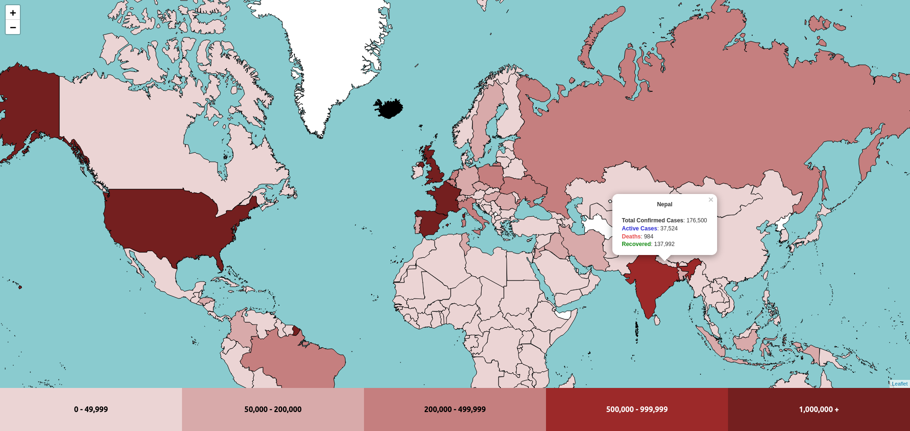

# Covid-19 Chloropleth map visualizer

Map application showing the world map with chloropleth visualization with different colour indication according to the number of active cases. App shows the details of cases for each country when clicked on respective country

See [Demo](https://prajwalrajbasnet.github.io/covid19-choloropleth-worldmap/)

## Setup

Clone the repository, go to project folder install dependencies and Voilà you're ready to go!.

    $ git clone git@github.com:Prajwalrajbasnet/covid19-choloropleth-worldmap.git (SSH) or
      git clone https://github.com/Prajwalrajbasnet/covid19-choloropleth-worldmap.git (HTTPS)
    $ cd covid19-chloropleth
    $ rm -rf .git
    $ yarn install

Start the application!

`yarn start`

Now your browser should automatically open the app if not go to https://localhost:3000 where you would see something like this :-

